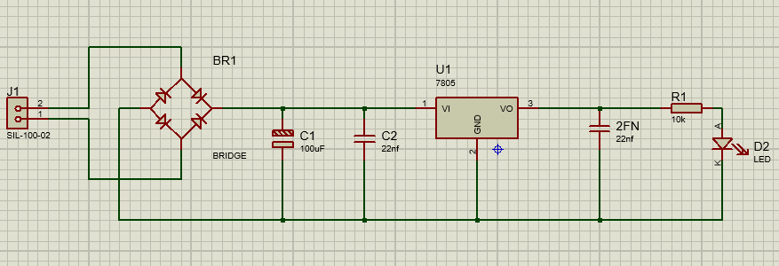
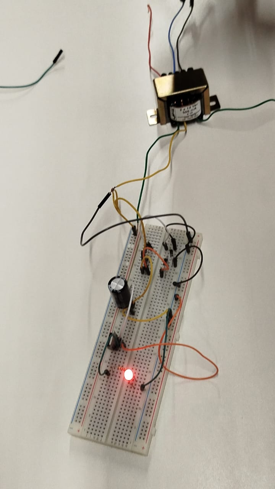
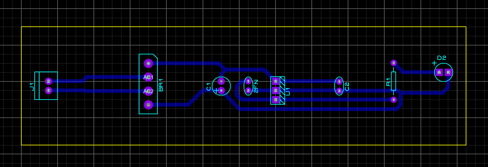
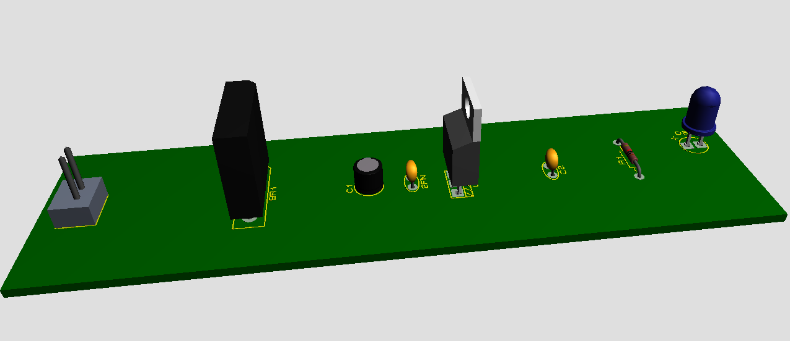

# Retificador
semplies repository to store my embedded systems activities - Unimater

# Funcionamento de um Retificador

Um retificador é um dispositivo eletrônico utilizado para converter corrente alternada (CA) em corrente contínua (CC). Ele é comumente usado em fontes de alimentação para eletrônicos e em sistemas de energia renovável, como painéis solares e turbinas eólicas. O funcionamento básico de um retificador envolve a conversão dos ciclos alternados da corrente elétrica em uma única direção.

## Simulação

Antes de projetar um retificador, é comum realizar simulações para entender o comportamento do circuito e otimizar seu desempenho. Software de simulação de circuitos, como SPICE (Simulation Program with Integrated Circuit Emphasis), é frequentemente utilizado para modelar o comportamento do retificador em diferentes condições de operação, permitindo aos engenheiros ajustar parâmetros e identificar possíveis problemas antes da prototipagem.

## Prototipagem

Após a simulação, o próximo passo é a prototipagem do retificador. Nesta etapa, os componentes do circuito são montados em uma placa de circuito impresso (PCB) de acordo com o projeto elaborado durante a fase de simulação. A prototipagem permite testar o funcionamento real do retificador e realizar ajustes finos no circuito, se necessário.

## PCB

A placa de circuito impresso (PCB) é uma parte essencial do processo de construção do retificador. Ela fornece uma plataforma para montar e interconectar os componentes eletrônicos do circuito de forma organizada e eficiente. Durante o design da PCB, são considerados fatores como tamanho, dissipação de calor, impedância eletromagnética e roteamento de trilhas para garantir o desempenho adequado do retificador.

## 3D

Além da eletrônica, o design em 3D também desempenha um papel importante na construção de retificadores, especialmente quando se trata de gabinetes e estruturas de resfriamento. Modelagem em 3D permite visualizar e otimizar o layout físico do retificador, garantindo que os componentes estejam dispostos de forma eficiente e que haja espaço adequado para ventilação e dissipação de calor.

Esses aspectos de simulação, prototipagem, PCB e design em 3D são fundamentais para o desenvolvimento bem-sucedido de retificadores, garantindo seu funcionamento confiável e eficiente em diversas aplicações.

### Simulação 

### Prototipagem

### PCB

### 3D
